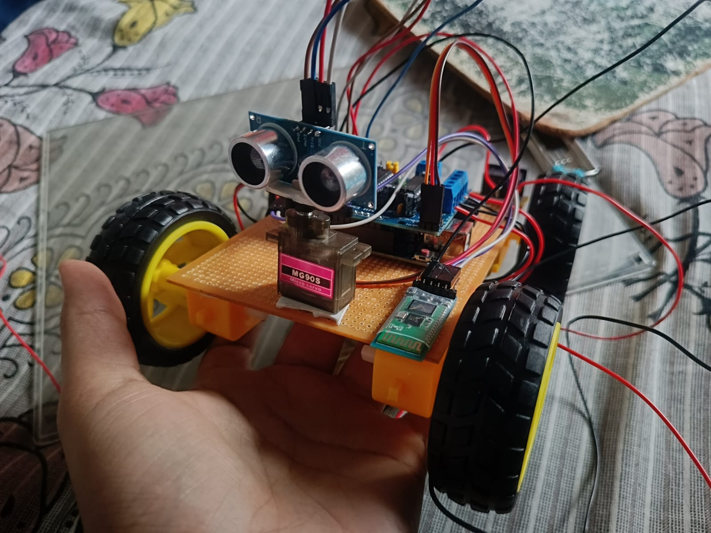
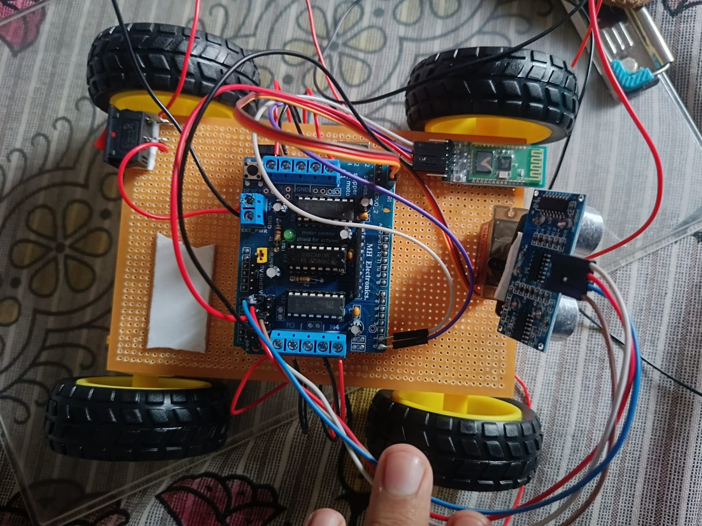

# Smart Robotic Vehicle With Distance Sensing

A 4-wheel-drive robotic vehicle built with Arduino, controlled via Bluetooth from a mobile app. It also includes ultrasonic distance sensing and voice control features for future upgrades.

## How It Works

The car is driven by 4 DC motors via an Adafruit Motor Shield (AFMotor library). Commands are sent over Bluetooth from a mobile app (e.g. Arduino Bluetooth Controller / similar HC-05 control apps) as single characters, which the Arduino reads over Serial and maps to motor actions.

A servo-mounted ultrasonic sensor (HC-SR04) is also wired in for distance sensing — currently used for measuring distance left/right, with the groundwork laid for full autonomous obstacle avoidance in a future version.

## Features

- **Bluetooth control (active)** — drive forward, backward, left, right, and stop using a mobile Bluetooth app
- **Distance sensing (hardware present)** — ultrasonic sensor + servo sweep to measure distance on either side
- **Obstacle avoidance (in code, not yet active)** — logic written to auto-reverse and turn toward the clearer side when an obstacle is detected within 12cm
- **Voice control (in code, not yet active)** — accepts symbolic voice-to-text commands (`^` `-` `<` `>` `*`)

## Hardware Used

- Arduino Uno (or compatible)
- Adafruit Motor Shield (L293D-based, AFMotor library)
- 4x DC Motors
- HC-SR04 Ultrasonic Distance Sensor
- SG90 (or similar) Servo Motor
- HC-05 Bluetooth Module
- Chassis + wheels + battery pack

## Circuit Diagram

<table>
  <tr>
    <td></td>
    <td></td>
  </tr>
</table>

## Software / Libraries

- `Servo.h`
- `AFMotor.h`

Install `AFMotor` via the Arduino Library Manager (or Adafruit's GitHub) before compiling.

## Bluetooth Command Reference

| Command | Action |
|---|---|
| `F` | Move forward |
| `B` | Move backward |
| `L` | Turn left |
| `R` | Turn right |
| `S` | Stop |

Pair your HC-05/HC-06 Bluetooth module with your phone, connect via any serial Bluetooth controller app, and send these characters as button presses.

## Setup

1. Open `SmartRoboticVehicle.ino` in the Arduino IDE.
2. Install the `AFMotor` library if not already installed.
3. Connect hardware as per pin definitions in the code:
   - Ultrasonic: `Trig` → A1, `Echo` → A0
   - Servo → Pin 10
   - Motors → Motor Shield ports M1–M4
   - Bluetooth module → Arduino RX/TX (Serial)
4. Upload the sketch to your Arduino.
5. Pair your phone with the Bluetooth module and start sending movement commands.

## Future Upgrades

- Improve obstacle avoidance accuracy with sensor filtering/averaging to reduce false triggers from noisy ultrasonic readings
- Add an Android/iOS companion app with live distance readouts and a manual override switch between Bluetooth and autonomous mode
- Possibly add an app/dashboard for live distance readings

## Status

## Status

Fully functional. Supports Bluetooth control, autonomous obstacle avoidance, and voice control.
